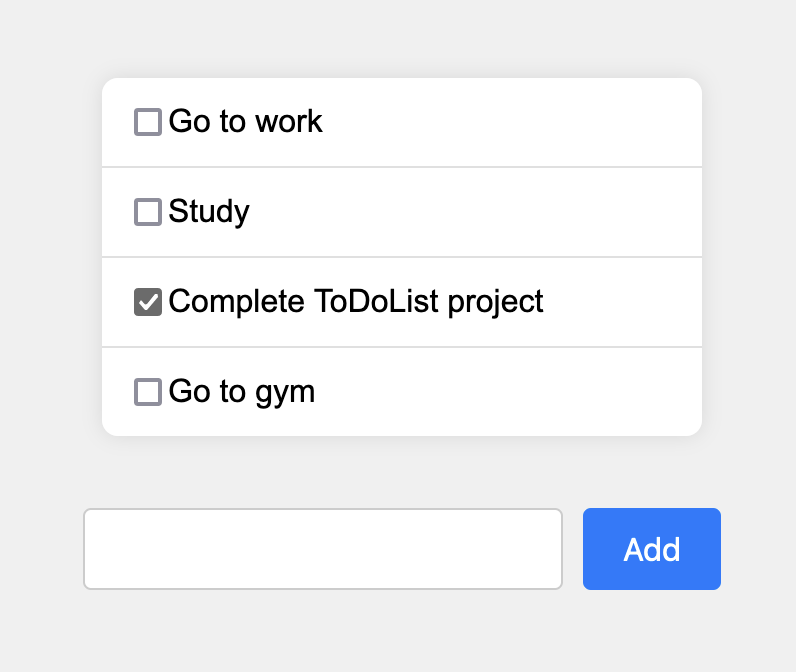

# TypeScript To-Do List

This project is a simple To-Do list application built with TypeScript. It utilizes the Vite vanilla TypeScript template for project setup. Tasks are stored locally using the browser's localStorage API, ensuring persistence across page refreshes.

## Features

- Add tasks with a unique identifier generated using the "uuid" library.
- Store tasks locally in the browser using localStorage.
- Responsive design for various screen sizes.

## Project Structure

The project structure is straightforward:

- **index.html**: Entry point HTML file.
- **src/**: Directory containing TypeScript source code.
  - **main.ts**: Main TypeScript file where the application logic resides.
- **todo.png**: Screenshot of the project in the root directory.

## Getting Started

To run the project locally:

1. Clone this repository.
2. Navigate to the project directory.
3. Install dependencies with `npm install`.
4. Run the development server with `npm run dev`.
5. Open your browser and navigate to `http://localhost:5173`.

## Screenshot

## Technologies Used

- TypeScript
- Vite
- uuid
- HTML/CSS

## License

This project is licensed under the MIT License - see the LICENSE file for details.
